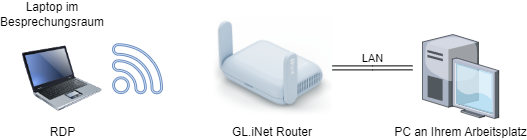

# Ein Netzwerk mit GL.iNet-Routern aufbauen

Mit GL.iNet-Routern können Sie ein Netzwerk für verschiedene Zwecke aufbauen. Beispiele hierfür sind das Verbinden von Bühnengeräten für Outdoor-Veranstaltungen, die Erweiterung der Reichweite zur Steuerung einer Drohne oder das Einrichten eines Büronetzwerks.

## Topologie

{class="glboxshadow"}

### Ein Büronetzwerk

Sie können Ihren PC über ein LAN-Kabel anschließen und dann Ihren Laptop per WLAN verbinden. Beide Geräte wären dann im selben Netzwerk, und Sie könnten Windows Remotedesktop nutzen, um gegenseitig auf die Geräte zuzugreifen.

### Weitere Beispiele

[Stage Management](https://www.linkedin.com/posts/gl-inet.com_today-we-would-like-to-share-a-customer-activity-7070333936018624512-vl5O?utm_source=share&utm_medium=member_ios)
