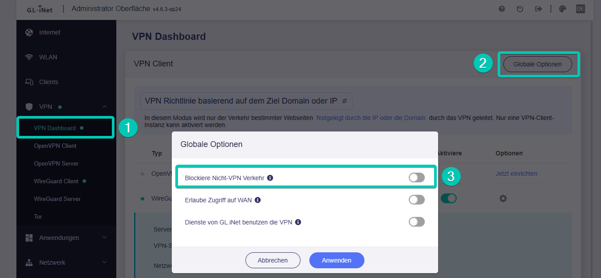

# Wie kann ich alle Daten über VPN leiten?

Wenn Sie alle Daten auf dem Router über VPN leiten möchten, befolgen Sie bitte die folgenden Schritte:

* Auf der linken Seite des Web-Admin-Panels -> VPN -> VPN-Dashboard.
* Im Abschnitt **VPN Client** klicken Sie auf **Globale Optionen**, schalten Sie **Blockiere Nicht-VPN Verkehr** ein und klicken Sie dann auf die Schaltfläche **Anwenden**.

{class="glboxshadow"}

**Hinweis:** Der VPN-Client muss ausgeführt werden, andernfalls kann keine Verbindung zum Internet hergestellt werden. Wenn Sie die VPN-Verbindung manuell trennen, wird der Internetzugriff unterbrochen.

---

Haben Sie noch Fragen? Besuchen Sie unser [Community Forum](https://forum.gl-inet.com){target="_blank"}.
