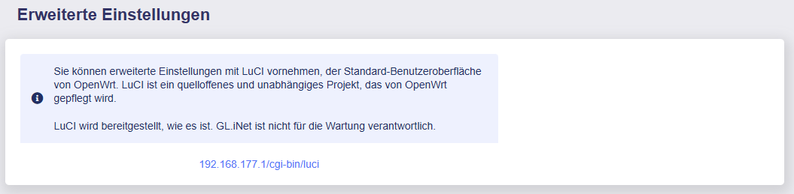

# Was ist LuCI?

LuCI ist die Web-Benutzeroberfläche von OpenWrt.

Um auf LuCI zuzugreifen, navigieren Sie in der Administrator Oberfläche auf der linken Seite zu -> **System** -> **Erweiterte Einstellungen**.

In LuCI können Sie einige erweiterte Einstellungen vornehmen.

{class="glboxshadow"}

Klicken Sie auf den Link **192.168.8.1/cgi-bin/luci**, um die LuCI-Seite aufzurufen.

---

Haben Sie noch Fragen? Besuchen Sie unser [Community Forum](https://forum.gl-inet.com){target="_blank"}.
