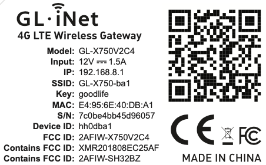
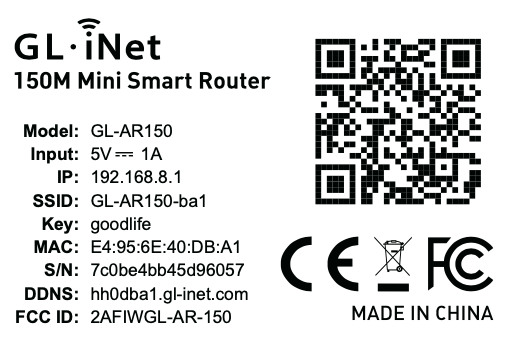
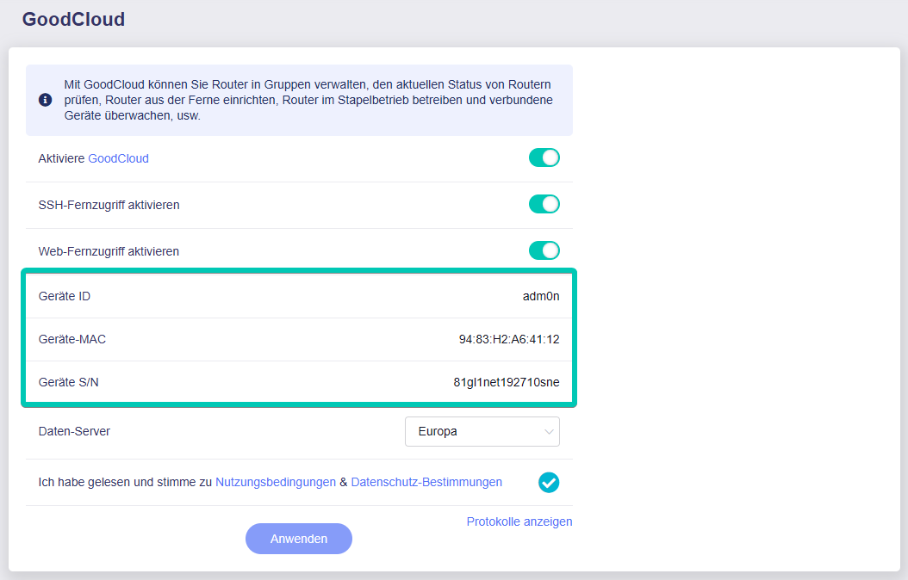

# Wo findet man die Geräte-ID, MAC-Adresse und Seriennummer?

## Methode 1:

Bei den meisten Modellen finden Sie diese Informationen auf der Rückseite Ihres Routers.

Bei neueren Modellen ähnelt das Etikett auf der Rückseite des Routers dem untenstehenden Bild. Zum Beispiel: Auf dem Bild unten ist die MAC-Adresse **E4:95:6E:40:DB:A1**, die Geräte-ID **hh0dba1** und die Seriennummer **7c0be4bb45d96057**.

{class="glboxshadow"}

Bei älteren Modellen finden Sie die Geräte-ID nicht direkt, aber Sie können das DDNS finden. Tatsächlich sind die ersten 7 Zeichen des DDNS die Geräte-ID. Nehmen wir das folgende Bild als Beispiel: Die MAC-Adresse ist **E4:95:6E:40:DB:A1**, die Geräte-ID **hh0dba1** und die Seriennummer **7c0be4bb45d96057**.

{class="glboxshadow"}

## Methode 2:

Melden Sie sich in der Administratoroberfläche an. Sie finden diese Informationen auf der linken Seite unter -> **Anwendungen** -> **GoodCloud**.

{class="glboxshadow"}

---

Haben Sie noch Fragen? Besuchen Sie unser [Community Forum](https://forum.gl-inet.com){target="_blank"}.
