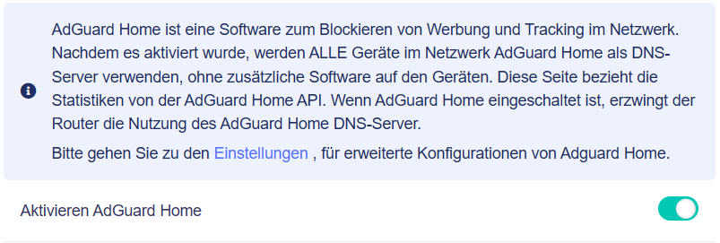
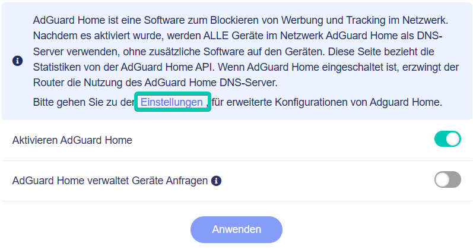
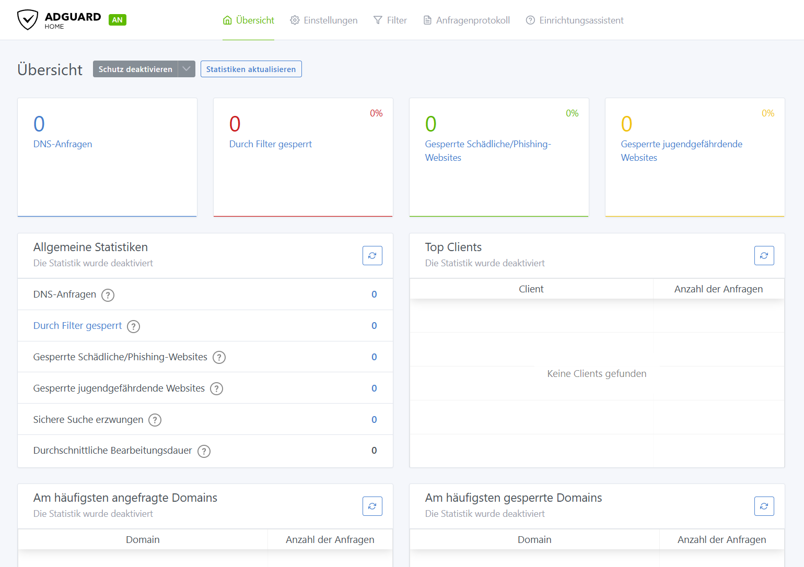

# AdGuard Home

AdGuard Home ist eine netzwerkweite Software zum Blockieren von Werbung und Tracking. Klicken Sie auf die Schaltfläche **Start**, um fortzufahren.

## Unterstützte Modelle

| Router-Modell                  | Unterstützung |
| :----------------------------- | :-----------: |
| GL-B3000 (Marble)              | √             |
| GL-MT6000 (Flint2)             | √             |
| GL-X3000 (Spitz AX)            | √             |
| GL-XE3000 (Puli AX)            | √             |
| GL-MT3000 (Beryl AX)           | √             |
| GL-AXT1800 (Slate AX)          | √             |
| GL-A1300 (Slate Plus)          | √             |
| GL-MT2500/GL-MT2500A (Brume 2) | √             |
| GL-AX1800 (Flint)              | √             |
| GL-SFT1200 (Opal)              | -             |
| GL-S1300 (Convexa-S)           | √             |
| GL-MT1300 (Beryl)              | -             |
| GL-AR750S (Slate)              | -             |
| GL-XE300 (Puli)                | -             |
| GL-X750 (Spitz)                | -             |
| GL-B1300 (Convexa-B)           | -             |
| GL-AP1300 (Cirrus)             | √             |
| GL-X300B (Collie)              | -             |

{class="glboxshadow"}

Aktivieren Sie AdGuard Home, indem Sie unter **Anwendungen** > **AdGuard Home** auf **Start** klicken beziehungsweise den Schalter auf **Ein** setzen.

{class="glboxshadow"}

Sie werden zur eigenen Einstellungsseite von AdGuard Home weitergeleitet. Wenn Sie Fragen haben, besuchen Sie bitte das [Adguard Home Support Center](https://adguard.com/de/support.html){target="_blank"} für Hilfe.

{class="glboxshadow"}

---

Haben Sie noch Fragen? Besuchen Sie unser [Community Forum](https://forum.gl-inet.com){target="_blank"}.
