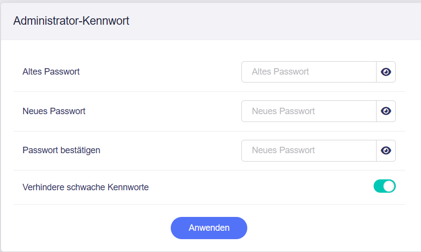

# Administrator-Kennwort

**Hinweis**: Die Funktion Admin-Passwort wurde seit Version 4.3 unter [Sicherheit](security.md) verschoben.

---

In der Administrator Oberfläche auf der linken Seite -> **SYSTEM** -> **Sicherheit** -> **Administrator-Kennwort**

{class="glboxshadow"}

Ändern Sie das Passwort für den Login in die Administrator Oberfläche. Sie müssen Ihr aktuelles Passwort eingeben, um es zu ändern.

Aus Sicherheitsgründen empfehlen wir, **Verhindere schwache Kennworte** zu aktivieren.

Wenn **Verhindere schwache Kennworte** aktiviert ist, gelten die folgenden Anforderungen für neue Passwörter:

- Mindestens 5 und maximal 63 Zeichen.
- Buchstaben (Groß- und Kleinschreibung), Zahlen und Symbole `` ! @ # $ % ^ & * ( ) _ + - = , . > < | ? / \ [ ] { } : ; " ' ` ~ `` sind erlaubt.
- Es müssen mindestens zwei der folgenden Gruppen enthalten sein: Großbuchstaben, Kleinbuchstaben, Zahlen und Symbole.

---

Haben Sie noch Fragen? Besuchen Sie unser [Community Forum](https://forum.gl-inet.com){target="_blank"}.
