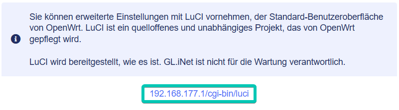

# Erweiterte Einstellungen

Im der Administrator Oberfläche auf der linken Seite -> **SYSTEM** -> **Erweiterte Einstellungen**

Sie können erweiterte Einstellungen in LuCI vornehmen, der Standard-Benutzeroberfläche von OpenWrt. LuCI ist ein offenes und unabhängiges Projekt, das von OpenWrt gepflegt wird.

Es handelt sich hierbei um eine Drittanbieteranwendung, die keinen offiziellen Support von GL.iNet erhält. Wenn Sie auf Probleme stoßen, wenden Sie sich bitte an die [OpenWrt-Community](https://forum.openwrt.org/){target="_blank"}.

Klicken Sie auf den Link **192.168.8.1/cgi-bin/luci**, um die LuCI-Seite aufzurufen.

{class="glboxshadow"}

---

Haben Sie noch Fragen? Besuchen Sie unser [Community Forum](https://forum.gl-inet.com){target="_blank"}.
