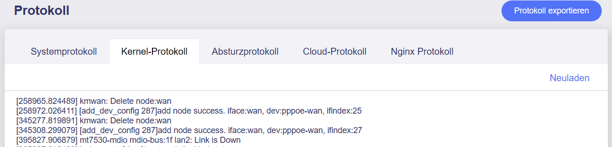

# Log

In der **Administrator Oberfläche** auf der linken Seite -> **SYSTEM** -> **Protokoll**

Auf der Log-Seite können Sie die Protokolle von System, Kernel, Crash und Cloud einsehen, um Analysen durchzuführen und Probleme zu beheben.

{class="glboxshadow"}

Klicken Sie auf **Neuladen**, um die neuesten Protokollinformationen abzurufen.

Klicken Sie auf **Protokoll exportieren**, um die Protokolldaten von System, Kernel, Crash und Cloud zu exportieren. Wenn Sie Feedback an GL.iNet senden, können Sie die exportierte Protokolldatei an den technischen Support weiterleiten, um eine schnellere Problemanalyse zu ermöglichen.

---

Haben Sie noch Fragen? Besuchen Sie unser [Community Forum](https://forum.gl-inet.com){target="_blank"}.