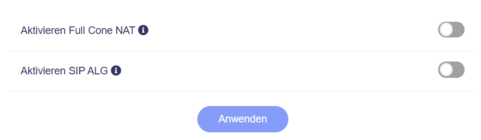

# NAT-Einstellungen

In der **Administrator Oberfläche** auf der linken Seite -> **NETZWERK** -> **NAT-Einstellungen**

Das **LAN-Netzwerk** ist das Netzwerk, mit dem Ihre Geräte verbunden sind, wenn sie über das Haupt-Wi-Fi oder ein Ethernet-Kabel verbunden sind.

{class="glboxshadow"}

## Full Cone NAT

Full Cone NAT kann verwendet werden, um die Latenzzeit bei Spielen zu verringern. Das Aktivieren von Full Cone NAT kann jedoch die Sicherheit beeinträchtigen, da Geräte innerhalb des Netzwerks von außen erreichbar sein können.

## SIP ALG

SIP ALG kann helfen, die Auswirkungen mehrerer NATs zu verringern, aber in den meisten Fällen bringt es keine Verbesserung. Das Aktivieren von SIP ALG kann VoIP-Anrufe beeinträchtigen, z. B. durch einseitige Audioverbindungen (nur eine Partei kann die andere hören), nicht klingelnde Telefone, Verbindungsabbrüche oder Anrufe, die direkt an die Mailbox weitergeleitet werden.

---

Haben Sie noch Fragen? Besuchen Sie unser [Community Forum](https://forum.gl-inet.com){target="_blank"}.
