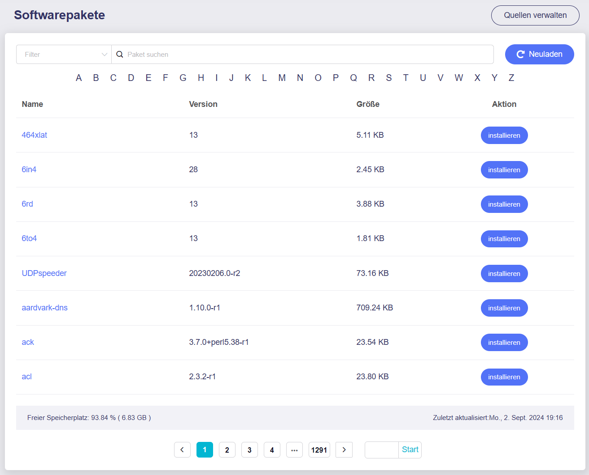

# Softwarepakete

In der **Administrator Oberfläche** auf der linken Seite -> **ANWENDUNGEN** -> **Softwarepakete**

Unter **Softwarepakete** können Sie OpenWrt-Pakete verwalten. Sie können Pakete installieren oder entfernen.

Es wird empfohlen, vor der Nutzung auf die Schaltfläche **Neuladen** zu klicken, um sicherzuerstellen, dass die neuesten Paketinformationen verfügbar sind.

Die folgende Abbildung zeigt die Plug-ins-Seite des GL-MT6000.

{class="glboxshadow"}

Bitte beachten Sie, dass es sich bei den Softwarepaketen um Drittanbieter-Software handelt, die von der OpenWrt-Community bereitgestellt wird. GL.iNet übernimmt keine Verantwortung für die Softwarepakete.

---

Haben Sie noch Fragen? Besuchen Sie unser [Community Forum](https://forum.gl-inet.com){target="_blank"}.
