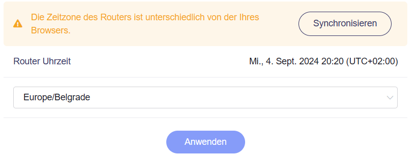
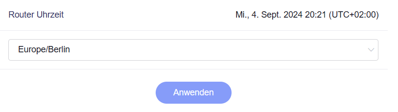

# Zeitzone

In der **Administrator Oberfläche** auf der linken Seite -> **SYSTEM** -> **Zeitzone**

Die Einträge im Log sowie die geplanten Tasks werden immer anhand der Uhrzeit innerhalb des Routers gehandhabt. Stellen Sie daher sicher, dass Sie die richtige Zeitzone synchronisiert/ausgewählt haben.

Die Zeitzone wird nicht automatisch synchronisiert. Sie müssen auf die Schaltfläche **Synchronisieren** klicken.

{class="glboxshadow"}

Nach der Synchronisierung:

{class="glboxshadow"}

---

Haben Sie noch Fragen? Besuchen Sie unser [Community Forum](https://forum.gl-inet.com){target="_blank"}.
