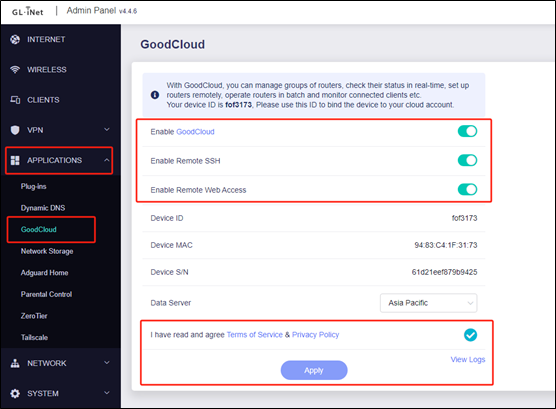
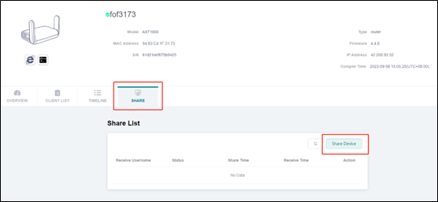
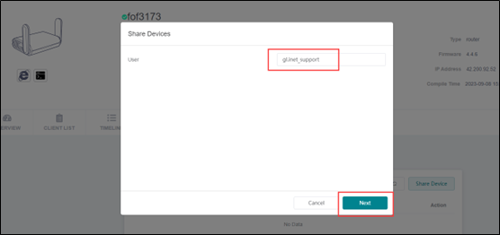
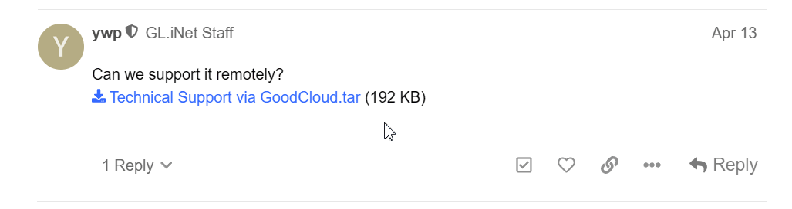

# Technical Support via GoodCloud

Sometimes it is necessary to get technical support from GL.iNet staff and they may ask you to share the your device using GoodCloud. This guide will show you how to share your device with GL.iNet staff.

## Enable GoodCloud management and remote control

In order to troubleshoot modem issues, you will need to give an extra Internet connection to the router to ensure the Internet connection. Please use the cable or repeater to build the 2nd connection and make sure it works.

In the router’s admin panel, go to APPLICATIONS > GoodCloud and enable GoodCloud, Remote SSH and Remote Web Access, then agree the terms and click on the Apply button. As per the following picture.

## Register GoodCloud account and bind your device to your account

You might need to create a GoodCloud account and bind your device to your account first.

1. Go to [GoodCloud](https://www.goodcloud.xyz/#/login) and log in or sign up for an account.
2. Bind your device to GoodCloud. Refer to [Add Device](https://docs.gl-inet.com/router/en/4/interface_guide/cloud/#add-device).

## Share to GL.iNet technical support 

Login [GoodCloud](https://www.goodcloud.xyz/#/login), go to Devices menu and click on the corresponding device. You will be lead to the detals page, click the **SHARE** tab and Share Device as per the following picture. Then share the device to the `gl.inet_support` account:

## Provide the login credentials to GL.iNet technical support

After sharing the device, please provide the MAC address and your router’s login password so that we can log in and check this issue remotely.

You can send those information to the GL.iNet technical support via **PM** (private message) in the [offical forum](https://forum.gl-inet.com/):

1. Go to the [offical forum](https://forum.gl-inet.com/).
2. Click on the account of the GL.iNet technical supporter you are in contact with.
3. Click on the **Message** button to send a private message.

Sometimes, new users may not be able to send a private message to GL.iNet technical support. In that case, you can respond in the same thread where you're communicating and ask the technical supporter to send you a private message first.

Please **DO NOT** share your device details in public, only share them with GL.iNet technical support via PM.
